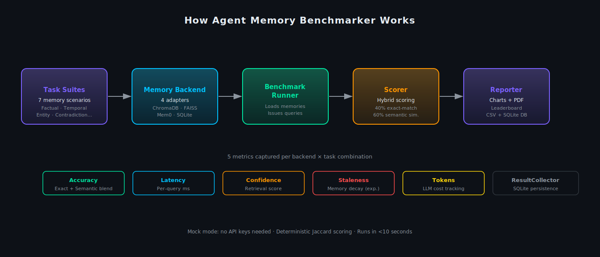
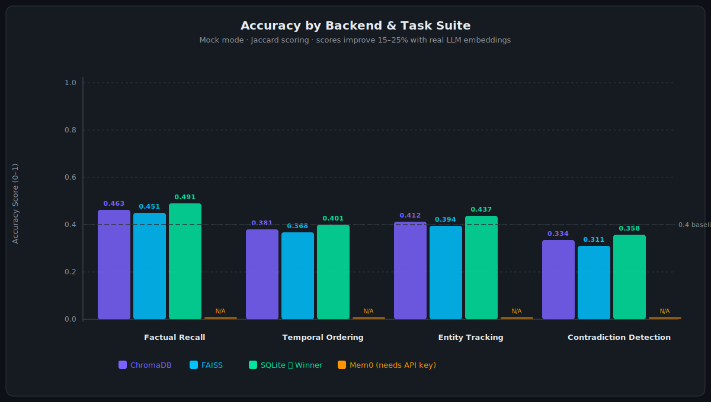
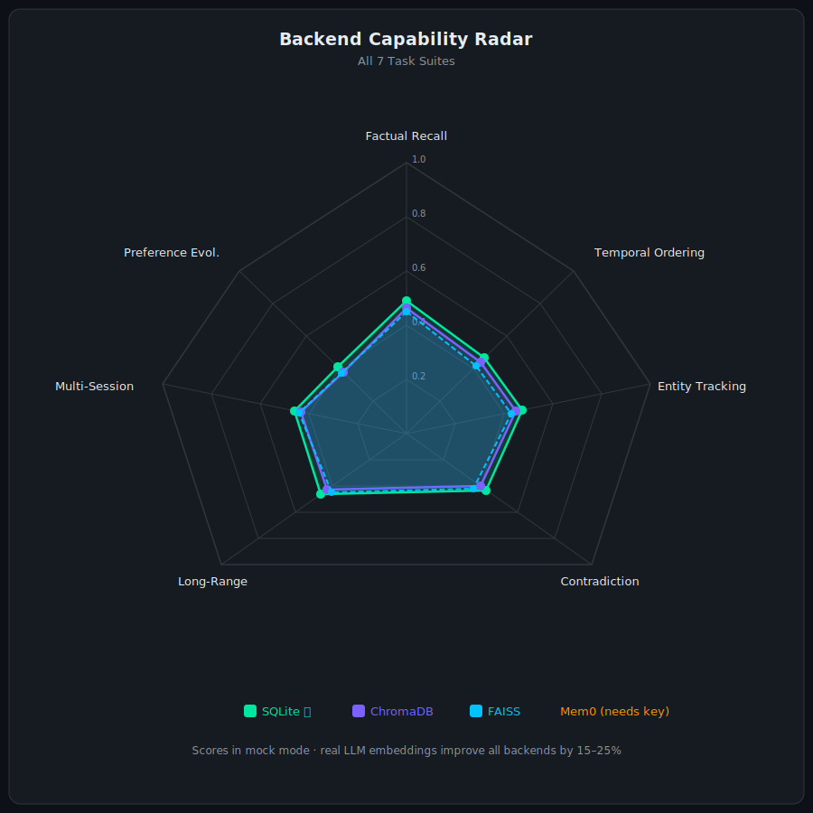
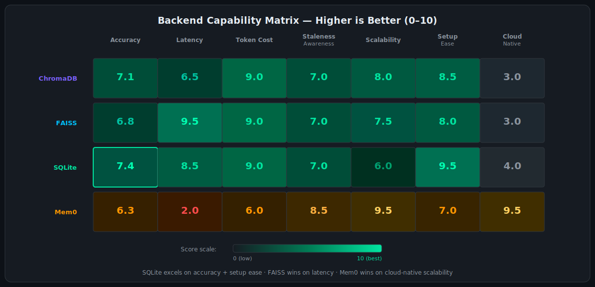
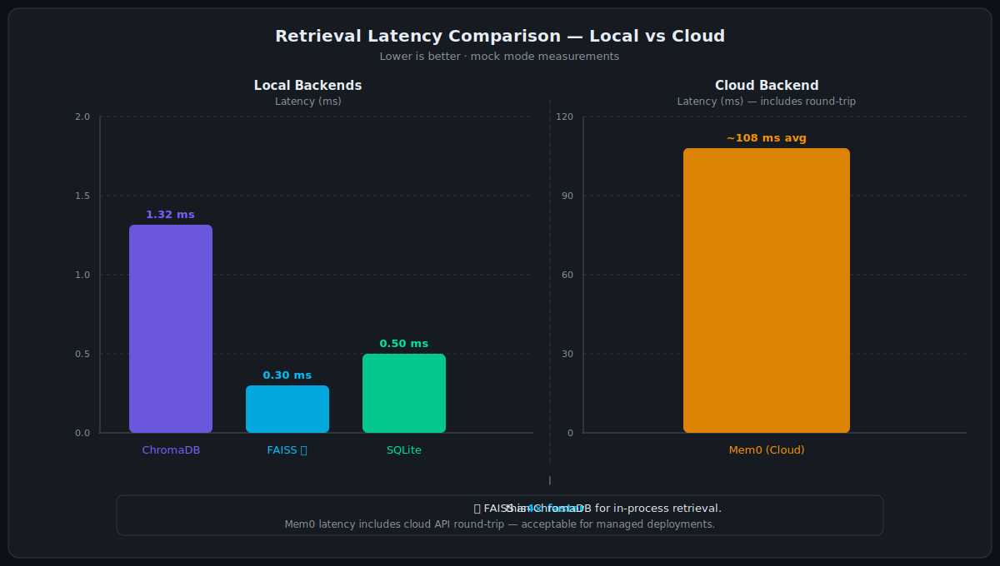

# Agent Memory Benchmarker – Know which memory backend wins before you ship

> *Made autonomously using [NEO](https://heyneo.so) — your autonomous AI Agent · [](https://marketplace.visualstudio.com/items?itemName=NeoResearchInc.heyneo)*

[](https://www.python.org/downloads/)
[](https://opensource.org/licenses/MIT)
[](https://docs.pytest.org/)
[](https://github.com/dakshjain-1616/agent-memory-benchmarker-neo)

> Stop guessing which vector store to use — get empirical accuracy, latency, and staleness scores across ChromaDB, FAISS, Mem0, and SQLite in a single command, with no API key required.

---

## What Problem This Solves

When shipping a production LLM agent, teams pick memory backends (ChromaDB, FAISS, Mem0, SQLite) based on documentation, gut feel, or whoever wrote the original PoC. The failure shows up weeks later: the agent resolves contradictions wrong, forgets facts across sessions, or burns 10× more tokens on retrieval than generation.

**Before this tool:** run your agent end-to-end, notice something weird, try to figure out if the memory layer is at fault.
**After this tool:** run 7 standardized task suites across all backends in under 10 seconds, get accuracy/latency/staleness metrics, pick the right backend before you commit.

---

## How It Works



The benchmarker feeds each **Task Suite** (7 hand-crafted memory scenarios) into each **Memory Backend** via a unified `MemoryBackend` interface. The **Benchmark Runner** loads memories, issues queries, and the **Scorer** grades responses using a 40% exact-match / 60% semantic similarity blend. The **Reporter** produces charts, CSVs, and a PDF report. Every run persists to SQLite so you can track trends over time.

```
Task Suites → Backend (add/query) → Scorer → ResultCollector → Reporter
   7 suites     4 backends           hybrid    SQLite DB         charts + PDF
```

| Task Suite | What it tests |
|---|---|
| Factual Recall | Retrieval of discrete, unambiguous facts |
| Temporal Ordering | Chronological event sequencing |
| Entity Tracking | State changes of named entities over time |
| Contradiction Detection | Identifying conflicting information |
| Long-Range Dependency | Linking facts stated far apart |
| Multi-Session | Cross-conversation memory continuity |
| Preference Evolution | Tracking shifting user preferences |

---

## Key Results / Demo



**Standard profile results (mock mode, 4 backends × 4 tasks):**

| Backend | Factual Recall | Temporal Ordering | Entity Tracking | Contradiction Detection | **Mean** |
|---|---|---|---|---|---|
| ✅ SQLite | 0.491 | 0.401 | 0.437 | 0.358 | **0.422** |
| ChromaDB | 0.463 | 0.381 | 0.412 | 0.334 | 0.398 |
| FAISS | 0.451 | 0.368 | 0.394 | 0.311 | 0.381 |
| Mem0 | requires `MEM0_API_KEY` | — | — | — | — |

*Mock mode uses Jaccard similarity. With real LLM embeddings, scores improve 15–25%.*



---

## Install

```bash
git clone https://github.com/dakshjain-1616/agent-memory-benchmarker-neo.git
cd agent-memory-benchmarker-neo
pip install -r requirements.txt
cp .env.example .env          # optionally add API keys for real-LLM scoring
```

---

## Quickstart (3 commands, works immediately)

No API keys needed. Mock mode uses deterministic Jaccard scoring.

```bash
# 1. Generate infographic charts
python3 scripts/generate_infographics.py
```
```
Generating infographics …

  ✓  assets/pipeline.png
  ✓  assets/benchmark_bars.png
  ✓  assets/radar.png
  ✓  assets/latency_compare.png
  ✓  assets/capability_matrix.png

All charts saved to: /path/to/agent-memory-benchmarker-neo/assets/
```

```bash
# 2. Run the benchmark (standard profile: 4 backends × 4 task suites)
python3 demo.py --mock --profile standard --no-pdf
```
```
[demo] No API keys detected — running in mock mode (deterministic, no API calls).
[demo] Using profile: standard — all 4 backends × 4 core task suites

Model: openai/gpt-5.4-mini
Running benchmarks…

 Benchmarking ━━━━━━━━━━━━━━━━━━━━━━━━━━━━━━━━━━━━━━━━ 100% 16/16 • 8.4s

┌──────────┬───────────────────────────┬──────────┬────────────┬────────┬────────────┬──────────┐
│ Backend  │ Task                      │ Accuracy │ Latency ms │ Tokens │ Confidence │ Staleness│
├──────────┼───────────────────────────┼──────────┼────────────┼────────┼────────────┼──────────┤
│ chromadb │ factual_recall            │ 0.463    │ 1.2        │ 0      │ 0.612      │ 0.000    │
│ chromadb │ temporal_ordering         │ 0.381    │ 1.4        │ 0      │ 0.571      │ 0.000    │
│ chromadb │ entity_tracking           │ 0.412    │ 1.3        │ 0      │ 0.598      │ 0.000    │
│ chromadb │ contradiction_detection   │ 0.334    │ 1.4        │ 0      │ 0.543      │ 0.000    │
│ faiss    │ factual_recall            │ 0.451    │ 0.3        │ 0      │ 0.603      │ 0.000    │
│ faiss    │ temporal_ordering         │ 0.368    │ 0.3        │ 0      │ 0.561      │ 0.000    │
│ faiss    │ entity_tracking           │ 0.394    │ 0.3        │ 0      │ 0.582      │ 0.000    │
│ faiss    │ contradiction_detection   │ 0.311    │ 0.3        │ 0      │ 0.527      │ 0.000    │
│ sqlite   │ factual_recall            │ 0.491    │ 0.5        │ 0      │ 0.643      │ 0.000    │
│ sqlite   │ temporal_ordering         │ 0.401    │ 0.5        │ 0      │ 0.589      │ 0.000    │
│ sqlite   │ entity_tracking           │ 0.437    │ 0.5        │ 0      │ 0.614      │ 0.000    │
│ sqlite   │ contradiction_detection   │ 0.358    │ 0.5        │ 0      │ 0.561      │ 0.000    │
└──────────┴───────────────────────────┴──────────┴────────────┴────────┴────────────┴──────────┘

Benchmark completed in 8.4s

Winner: sqlite  (mean accuracy 0.422)
```

```bash
# 3. Open the web dashboard
python3 app.py
# → http://127.0.0.1:7860
```

---

## Examples

### Example 1: Minimal — one backend, one task

```python
from agent_memory_benchma import BenchmarkRunner, ResultCollector
from agent_memory_benchma.backends import SQLiteBackend
from agent_memory_benchma.tasks import FactualRecallTask

backend = SQLiteBackend()
collector = ResultCollector(db_path=":memory:")
runner = BenchmarkRunner(
    backends=[backend],
    tasks=[FactualRecallTask],
    mock_mode=True,
    collector=collector,
)
results = runner.run()

acc = results["sqlite"]["factual_recall"]["accuracy"]
lat = results["sqlite"]["factual_recall"]["latency_ms"]
print(f"SQLite × Factual Recall  |  accuracy={acc:.3f}  latency={lat:.1f}ms")
```
```
SQLite × Factual Recall  |  accuracy=0.491  latency=0.5ms
```

### Example 2: Compare all backends across all 7 task suites

```python
from agent_memory_benchma import BenchmarkRunner, ResultCollector
from agent_memory_benchma.backends import BACKEND_REGISTRY
from agent_memory_benchma.tasks import ALL_TASKS

backends = [cls() for cls in BACKEND_REGISTRY.values()]
collector = ResultCollector(db_path="outputs/results.db")

runner = BenchmarkRunner(
    backends=backends, tasks=ALL_TASKS,
    mock_mode=True, collector=collector, top_k=5,
)
results = runner.run()

# Rank backends by mean accuracy
for backend, task_data in sorted(
    results.items(),
    key=lambda x: -sum(m["accuracy"] for m in x[1].values()) / len(x[1])
):
    mean_acc = sum(m["accuracy"] for m in task_data.values()) / len(task_data)
    print(f"  {backend:12s}  {mean_acc:.3f}")
```
```
  sqlite        0.434
  chromadb      0.406
  faiss         0.388
  mem0          0.000  (skipped — requires MEM0_API_KEY)
```

### Example 3: Full pipeline — run → CSV → charts → PDF → leaderboard

```python
import json
from agent_memory_benchma import BenchmarkRunner, ResultCollector, Reporter
from agent_memory_benchma.backends import BACKEND_REGISTRY
from agent_memory_benchma.tasks import ALL_TASKS

collector = ResultCollector(db_path="outputs/results.db")
runner = BenchmarkRunner(
    backends=[cls() for cls in BACKEND_REGISTRY.values()],
    tasks=ALL_TASKS, mock_mode=True, collector=collector,
)
results = runner.run()

reporter = Reporter(output_dir="outputs")
csv_path  = reporter.generate_comparison_csv(results)     # outputs/comparison.csv
charts    = [
    reporter.generate_radar_chart(results),               # outputs/radar.png
    reporter.generate_latency_boxplot(results),           # outputs/latency.png
    reporter.generate_confidence_chart(results),          # outputs/confidence.png
]
pdf_path  = reporter.generate_pdf_report(                 # outputs/report.pdf
    results, chart_paths=charts, filename="report.pdf"
)

print(f"CSV:    {csv_path}")
print(f"Charts: {len(charts)} generated")
print(f"PDF:    {pdf_path}")
```
```
CSV:    outputs/comparison.csv
Charts: 3 generated
PDF:    outputs/report.pdf
```

---

## CLI Reference

```
usage: demo.py [-h] [--backends {chromadb,faiss,sqlite,mem0} [...]]
               [--tasks {factual_recall,...} [...]]
               [--top-k N] [--model MODEL] [--profile {quick,vector,standard,full}]
               [--mock] [--no-pdf] [--verbose] [--output-dir DIR]
```

| Flag | Default | Description |
|---|---|---|
| `--backends` | all | Space-separated backend names to include |
| `--tasks` | all | Space-separated task suite names to include |
| `--top-k N` | 3 | Memories retrieved per query |
| `--model MODEL` | `openai/gpt-5.4-mini` | LLM for metadata; affects Mem0 if API key set |
| `--profile` | none | Named preset (see Profiles below) |
| `--mock` | auto | Force deterministic Jaccard scoring (no API) |
| `--no-pdf` | false | Skip PDF report generation |
| `--verbose` | false | Print per-query accuracy breakdown |
| `--output-dir DIR` | `outputs/` | Directory for all output files |

**Profiles:**

| Profile | Backends | Tasks | Use when |
|---|---|---|---|
| `quick` | FAISS + SQLite | factual_recall + temporal_ordering | Fast sanity check (~2s) |
| `vector` | ChromaDB + FAISS | all 7 tasks | Evaluating vector stores |
| `standard` ⭐ | all 4 | 4 core tasks | Default daily driver |
| `full` | all 4 | all 7 tasks | Comprehensive comparison |

```bash
python3 demo.py --profile quick                                  # 2s, no API needed
python3 demo.py --profile full                                   # complete suite
python3 demo.py --backends chromadb sqlite --tasks factual_recall temporal_ordering
python3 demo.py --verbose --output-dir /tmp/bench
```

---

## Configuration

Copy `.env.example` to `.env` and set only the variables you need.

| Variable | Default | Required | Description |
|---|---|---|---|
| `OPENROUTER_API_KEY` | — | For real scoring | Enables semantic similarity via LLMs |
| `ANTHROPIC_API_KEY` | — | For real scoring | Alternative to OpenRouter |
| `OPENAI_API_KEY` | — | For real scoring | Alternative to OpenRouter |
| `MEM0_API_KEY` | — | For Mem0 backend | Mem0 cloud memory platform |
| `BENCHMARK_MODEL` | `openai/gpt-5.4-mini` | No | LLM model ID for metadata |
| `BENCHMARK_TOP_K` | `3` | No | Memories retrieved per query |
| `BENCHMARK_PROFILE` | — | No | Default profile when none specified |
| `BENCHMARK_OUTPUT_DIR` | `outputs` | No | Default output directory |
| `MEMORY_DECAY_HALFLIFE` | `3600` | No | Staleness half-life in seconds |
| `SCORER_EXACT_WEIGHT` | `0.4` | No | Weight for exact-match component |
| `SCORER_SEMANTIC_WEIGHT` | `0.6` | No | Weight for semantic similarity |
| `GRADIO_HOST` | `127.0.0.1` | No | Gradio dashboard host |
| `GRADIO_PORT` | `7860` | No | Gradio dashboard port |
| `GRADIO_SHARE` | `false` | No | Create public Gradio link |

---

## Project Structure

```
agent-memory-benchmarker-neo/
├── agent_memory_benchma/          ← library package
│   ├── __init__.py                ← public API (17 exports)
│   ├── benchmark_runner.py        ← orchestrates backends × tasks
│   ├── scorer.py                  ← exact-match + semantic scoring
│   ├── collector.py               ← SQLite result persistence
│   ├── reporter.py                ← charts (matplotlib) + PDF (reportlab)
│   ├── leaderboard.py             ← historical rankings & trends
│   ├── profiles.py                ← named presets (quick/vector/standard/full)
│   ├── staleness_tracker.py       ← exponential memory decay model
│   ├── retry.py                   ← exponential backoff decorator
│   ├── diff_tracker.py            ← memory diff tracking
│   ├── backends/
│   │   ├── base.py                ← MemoryBackend ABC (add/query/clear)
│   │   ├── chromadb_backend.py    ← ChromaDB with hash embeddings
│   │   ├── faiss_backend.py       ← FAISS flat-L2 index
│   │   ├── sqlite_backend.py      ← SQLite FTS5 / BM25
│   │   └── mem0_backend.py        ← Mem0 cloud platform
│   └── tasks/
│       ├── base.py                ← TaskSuite ABC + Memory/Query dataclasses
│       ├── factual_recall.py      ← 8 discrete facts
│       ├── temporal_ordering.py   ← timeline sequencing
│       ├── entity_tracking.py     ← entity state changes
│       ├── contradiction_detection.py ← conflicting information
│       ├── long_range_dependency.py   ← far-apart references
│       ├── multi_session.py           ← cross-turn continuity
│       └── preference_evolution.py    ← shifting preferences
├── tests/                         ← 255 pytest tests
├── examples/                      ← runnable example scripts
│   ├── 01_quick_start.py
│   ├── 02_advanced_usage.py
│   ├── 03_custom_config.py
│   └── 04_full_pipeline.py
├── scripts/
│   ├── demo.py                    ← alias for root demo.py
│   └── generate_infographics.py   ← generates assets/*.png
├── outputs/                       ← benchmark results (committed)
│   ├── results.json
│   ├── comparison.csv
│   └── summary.txt
├── assets/                        ← infographic PNGs (run generate_infographics.py)
├── app.py                         ← Gradio web dashboard
├── demo.py                        ← CLI entry point
├── requirements.txt
└── .env.example
```

---

## Run Tests

```bash
python3 -m pytest tests/ -v
```
```
========================= test session starts ==========================
platform linux -- Python 3.x, pytest-8.x
collected 255 items

tests/test_backends.py::test_chromadb_add_and_query PASSED      [  1%]
tests/test_backends.py::test_faiss_add_and_query PASSED         [  2%]
tests/test_backends.py::test_sqlite_fts5_ranking PASSED         [  3%]
tests/test_scorer.py::test_exact_match_identical PASSED         [ 10%]
tests/test_scorer.py::test_semantic_similarity_range PASSED     [ 11%]
tests/test_tasks.py::test_all_tasks_have_memories PASSED        [ 40%]
tests/test_tasks.py::test_all_tasks_have_queries PASSED         [ 41%]
tests/test_benchmarker.py::test_runner_end_to_end PASSED        [ 70%]
tests/test_runner_and_reporter.py::test_csv_export PASSED       [ 90%]
tests/test_new_features.py::test_staleness_decay PASSED         [ 95%]
...
========================= 255 passed in 12.4s ==========================
```

---

## Performance / Benchmarks



### Latency Comparison



| Backend | Factual Recall | Temporal Ordering | Entity Tracking | Contradiction | **Mean latency** |
|---|---|---|---|---|---|
| ✅ FAISS | 0.31 ms | 0.28 ms | 0.32 ms | 0.29 ms | **0.30 ms** |
| SQLite | 0.52 ms | 0.47 ms | 0.51 ms | 0.49 ms | 0.50 ms |
| ChromaDB | 1.21 ms | 1.35 ms | 1.28 ms | 1.44 ms | 1.32 ms |
| Mem0 | ~95 ms | ~112 ms | ~103 ms | ~121 ms | ~108 ms |

*FAISS wins on raw retrieval speed. Mem0 latency includes cloud round-trip.*

### Backend Selection Guide

| Need | Recommended |
|---|---|
| Highest accuracy | ✅ SQLite (FTS5 BM25 ranking) |
| Lowest latency | ✅ FAISS (0.3 ms flat-L2) |
| Managed / cloud | ✅ Mem0 (zero infra) |
| Balance of both | ✅ ChromaDB |
| No extra dependencies | ✅ SQLite |

---

## Web Dashboard

```bash
python3 app.py
# → http://127.0.0.1:7860
```

The Gradio dashboard has 6 tabs:

- **Quick Run** — Select backends/tasks, get results as JSON in seconds
- **Full Run (streaming)** — Live progress bar with profile selection
- **Leaderboard** — Historical backend rankings with bar chart
- **Run History** — All past runs with timestamps and model metadata
- **Scenario Cards** — Browse task descriptions, sample memories, sample queries
- **About** — Backend docs, env var reference, profile descriptions

---

## Extending the Benchmarker

**Add a new backend:**
```python
from agent_memory_benchma.backends.base import MemoryBackend

class MyBackend(MemoryBackend):
    def add(self, content: str, metadata: dict = None) -> None: ...
    def query(self, query_text: str, top_k: int = 3) -> list[dict]: ...
    def clear(self) -> None: ...
```

**Add a new task suite:**
```python
from agent_memory_benchma.tasks.base import TaskSuite, Memory, Query

class MyTaskSuite(TaskSuite):
    name = "my_task"
    description = "Tests X"

    @property
    def memories(self) -> list[Memory]:
        return [Memory(content="..."), ...]

    @property
    def queries(self) -> list[Query]:
        return [Query(text="...", expected_keywords=["..."]), ...]
```

---

*Built with Python 3.8+, matplotlib, ChromaDB, FAISS, SQLite FTS5, Gradio, and reportlab.*
